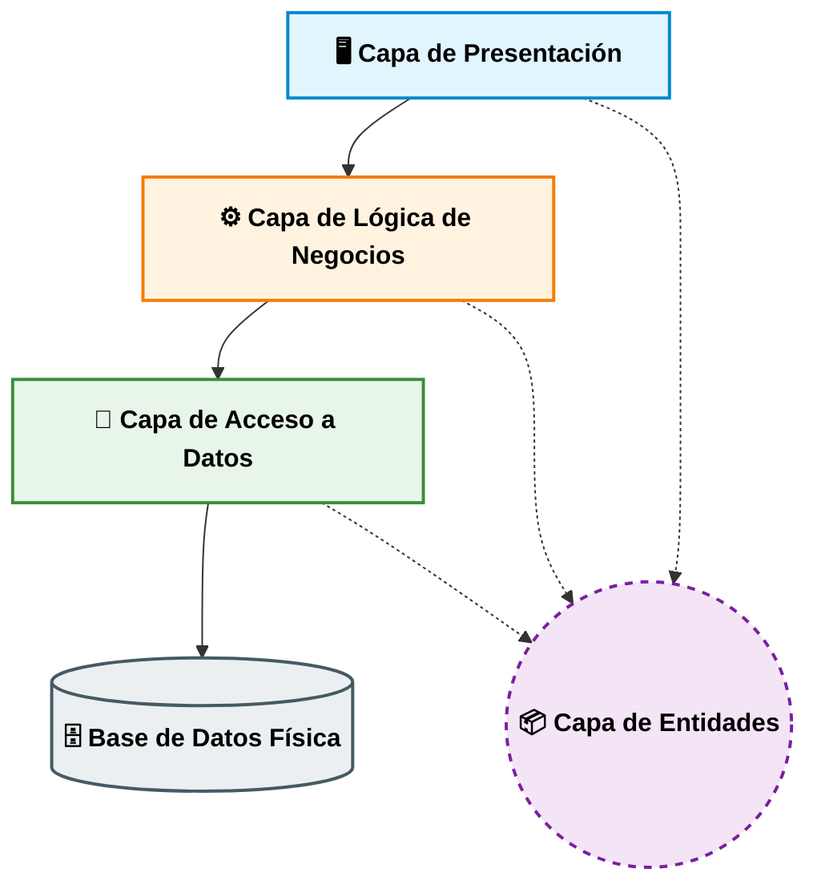

# Modelo de 4 Capas
El Modelo de 4 Capas (arquitectura multicapa) es un patrón de diseño de software que se utiliza para organizar el código de una aplicación en cuatro niveles de responsabilidad totalmente independientes.
El objetivo principal es aplicar el principio de "separación de conceptos". Es decir, que el código que dibuja la interfaz de usuario no se mezcle con el código que calcula los impuestos, ni con el código que guarda los datos en SQL.
## Capa de Presentación
Es la cara externa de la aplicación; el puente entre el usuario y el sistema. No contiene lógica de negocio ni sabe cómo guardar datos. La cual muestra la información en pantalla, renderiza los componentes visuales y captura las acciones del usuario
## Capa de Logica de Negocios
Es el cerebro y el corazón de la aplicación. Es la capa más importante porque aquí residen las reglas que hacen que el negocio funcione. Debe ser totalmente independiente de la base de datos y de la tecnología visual que uses.
La cual Aplica las fórmulas de cálculo, políticas de la empresa, restricciones de seguridad interna y estados financieros. Si las reglas de cobro de tu empresa cambian, solo se modifica esta capa.
## Capa de Datos
Es el puente técnico entre la lógica de tu programa y el almacenamiento físico. Su único propósito es saber cómo hablarle al motor de datos, el cual traduce las intenciones de la Lógica de Negocio en instrucciones que la base de datos entienda (consultas SQL, comandos de inserción, etc.). Se encarga de abrir y cerrar conexiones, iniciar transacciones y mapear los registros de las tablas hacia objetos de código.
## Capa de Entidades
Esta es la capa transversal (o compartida). No sigue el flujo vertical de arriba hacia abajo, sino que está ubicada "a un lado" de las demás, conectada con todas ellas.
La cual define los "moldes" o estructuras de datos con los que todo el sistema va a trabajar. Describe matemáticamente y en código qué campos componen a un objeto del negocio (por ejemplo, que un Curso tiene un Id, un Nombre y un Precio).
## Flujo de Comunicación y Dependencias
Profesionalmente, las capas no pueden hablar entre sí de forma caótica. Existe una regla de oro inquebrantable de unidireccionalidad para evitar dependencias circulares:

